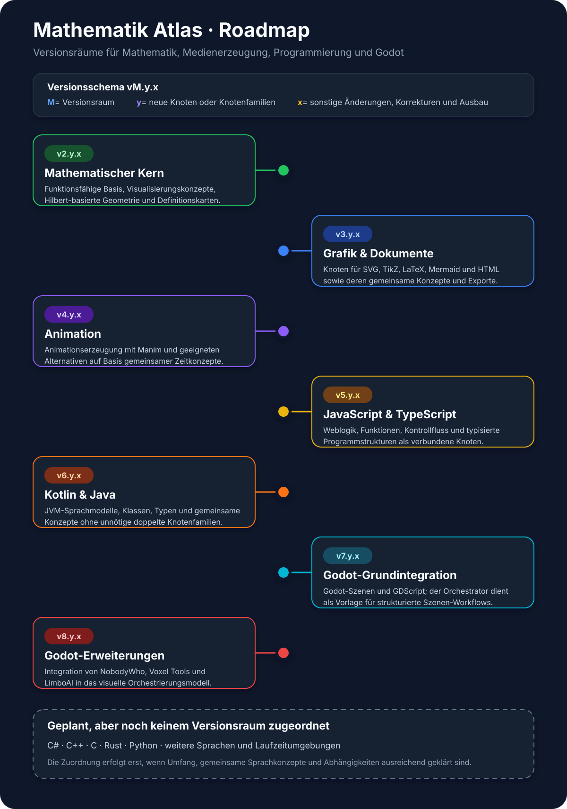

# Roadmap des Mathematik Atlas

Die Roadmap beschreibt die langfristige Produktvision. Sie ist keine Terminplanung und keine Behauptung, dass die genannten Funktionen bereits implementiert sind. Der nachweisbare aktuelle Stand ergibt sich aus dem Quellcode, `app/build.gradle.kts`, `release/roadmap.toml` und den verifizierten Projektunterlagen.

## Aktuelle Entwicklungsrichtung

Der Mathematik Atlas befindet sich im Versionsraum **v2.y.x – Mathematischer Kern**. In diesem Raum werden mathematische Objekte, Auswertung, Knotenkonzepte, Definitionskarten, Geometrie, Darstellung und Wiederverwendung stabilisiert.

## Versionsräume

### v2.y.x – Mathematischer Kern

- funktionsfähige Grundlage des Knotenkarten-Editors
- strukturierter mathematischer Kotlin-Rechenkern
- typisierte Anschlüsse und topologische Auswertung
- Definitions- und Konzeptkarten
- Hilbert-basierte Geometrie und mathematische Visualisierung
- wiederverwendbare Karten, Gruppenknoten und Methoden
- schrittweise Überarbeitung der Knotenverträge und ihrer Wechselwirkungen

### v3.y.x – Grafik, Auszeichnung und Dokumente

Geplant sind strukturierte Inhalte und Erzeugungspfade für SVG, TikZ, LaTeX, Mermaid, HTML und weitere dokumentorientierte Formate.

### v4.y.x – Animation

Geplant sind animierte mathematische Darstellungen, insbesondere über Manim oder geeignete Alternativen.

### v5.y.x – Web-Programmierung

Geplant sind Knoten und Karten für JavaScript, TypeScript und ihre Verbindung mit HTML- und Dokumentstrukturen.

### v6.y.x – JVM-Programmierung

Geplant sind Kotlin- und Java-Strukturen, Quellcodeerzeugung und formale Darstellung von Programmabläufen.

### v7.y.x – Godot-Grundintegration

Geplant sind Godot-Szenen, GDScript und ein Orchestrator als wiederverwendbare Vorlage für interaktive Anwendungen.

### v8.y.x – Godot-Erweiterungen

Geplant sind Integrationen für NobodyWho, Voxel Tools, LimboAI und weitere spezialisierte Godot-Systeme.

## Noch keinem Versionsraum zugeordnet

C#, C++, C, Rust, Python und weitere Sprachen oder Fachgebiete sind als mögliche Erweiterungen vorgesehen. Ein Versionsraum wird erst festgelegt, wenn gemeinsamer Umfang, Abhängigkeiten und Abgrenzung ausreichend geklärt sind.

## Wie die Roadmap gelesen wird

- `M` bezeichnet einen ausdrücklich festgelegten größeren Versionsraum.
- `y` steigt bei neuen, separat erzeugbaren Knotentypen oder Knotenfamilien.
- `x` steigt bei Änderungen ohne neuen Knotentyp, etwa Fehlerkorrekturen, Dokumentation oder dem Ausbau bestehender Knoten.

Die vollständigen Regeln stehen in [docs/VERSIONING.md](docs/VERSIONING.md). Der maschinenlesbare Releasezustand liegt in `release/roadmap.toml`.
